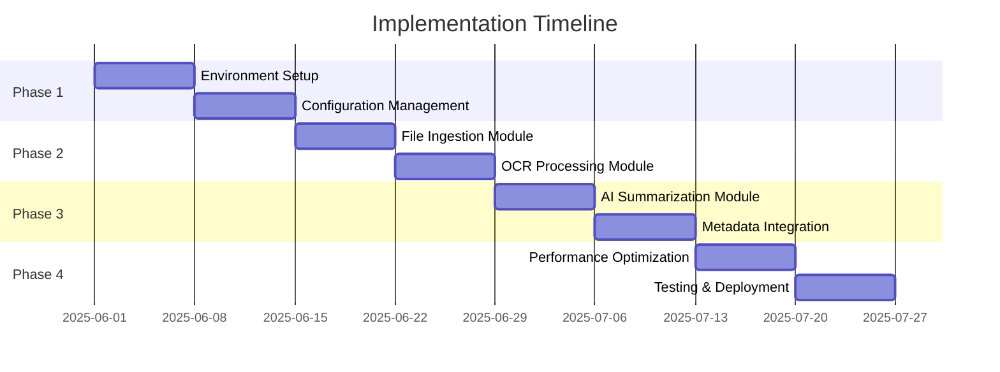

# Enhanced File Processing Pipeline Implementation Plan and Cost Analysis

## Executive Summary

This document provides a comprehensive implementation plan for deploying an enhanced file processing pipeline that integrates OCR solutions with AI-based text extraction and summarization for the Hansman Syracuse collection. The pipeline is designed to efficiently process 400+ historical documents while maintaining high accuracy and cost-effectiveness.

## Table of Contents

1. [Pipeline Architecture Overview](#pipeline-architecture-overview)
2. [Implementation Phases](#implementation-phases)
3. [Component Implementation Details](#component-implementation-details)
4. [Cost Analysis](#cost-analysis)
5. [Timeline and Milestones](#timeline-and-milestones)
6. [Integration Points](#integration-points)
7. [Maintenance and Monitoring](#maintenance-and-monitoring)
8. [Future Enhancements](#future-enhancements)

## Pipeline Architecture Overview

### System Components

```
┌─────────────────────┐     ┌─────────────────────┐     ┌─────────────────────┐
│  File Ingestion     │────>│   OCR Processing    │────>│  AI Summarization   │
│  & Validation       │     │   & Extraction      │     │  & Classification   │
└─────────────────────┘     └─────────────────────┘     └─────────────────────┘
         │                           │                           │
         v                           v                           v
┌─────────────────────┐     ┌─────────────────────┐     ┌─────────────────────┐
│ Metadata Storage    │<────│ Metadata Integration│<────│ Organization Logic  │
│                     │     │                     │     │                     │
└─────────────────────┘     └─────────────────────┘     └─────────────────────┘
```

### Technology Stack

- **OCR**: Tesseract (development), Google Cloud Vision (production)
- **AI**: Anthropic Claude API (claude-3-7-sonnet)
- **Storage**: Local filesystem, Dropbox integration, SQLite/JSON metadata
- **Caching**: Redis (optional)
- **Languages**: Python 3.8+
- **Frameworks**: asyncio, multiprocessing, threading

## Implementation Phases

### Phase 1: Foundation Setup (Weeks 1-2)

1. **Environment Setup**
   ```python
   # Install core dependencies
   pip install pytesseract opencv-python pillow
   pip install anthropic dropbox redis
   pip install psutil numpy pandas
   ```

2. **Configuration Management**
   ```python
   # config/pipeline_config.json
   {
     "ocr": {
       "engine": "tesseract",
       "fallback": "google_vision",
       "confidence_threshold": 0.6
     },
     "ai": {
       "model": "claude-3-7-sonnet-20250219",
       "max_tokens": 4000,
       "rate_limit": 50
     },
     "pipeline": {
       "max_workers": 8,
       "batch_size": 10,
       "cache_enabled": true
     }
   }
   ```

3. **API Setup**
   - Obtain Anthropic API key
   - Configure Google Cloud Vision credentials (optional)
   - Set up Dropbox OAuth tokens

### Phase 2: Core Pipeline Implementation (Weeks 3-4)

1. **File Ingestion Module**
   ```python
   from src.file_access.file_ingestion import FileIngestionEngine

   engine = FileIngestionEngine(
       queue_size=1000,
       validation_enabled=True,
       max_file_size_mb=50
   )
   ```

2. **OCR Processing Module**
   ```python
   from src.file_access.ocr_processor import OCRProcessor

   processor = OCRProcessor(
       primary_engine="tesseract",
       fallback_engine="google_vision",
       confidence_threshold=0.6
   )
   ```

3. **AI Summarization Module**
   ```python
   from src.metadata_extraction.ai_summarizer import AISummarizer

   summarizer = AISummarizer(
       claude_client=claude_client,
       syracuse_specific=True
   )
   ```

### Phase 3: Integration and Optimization (Weeks 5-6)

1. **Metadata Integration**
   ```python
   from src.integration.metadata_integration import MetadataIntegrationBridge

   bridge = MetadataIntegrationBridge(
       metadata_storage=storage,
       organization_engine=engine,
       conflict_resolution_strategy="confidence_based"
   )
   ```

2. **Performance Optimization**
   ```python
   from src.optimization.performance_optimizer import OptimizedPipeline

   pipeline = OptimizedPipeline(
       max_workers=8,
       use_multiprocessing=True,
       cache_enabled=True,
       optimization_level="balanced"
   )
   ```

### Phase 4: Testing and Deployment (Weeks 7-8)

1. **Testing Strategy**
   - Unit tests for all components
   - Integration tests with sample documents
   - Load testing with 400+ files
   - Performance benchmarking

2. **Deployment**
   - Containerization with Docker
   - CI/CD pipeline setup
   - Production monitoring

## Component Implementation Details

### 1. OCR Processing Configuration

```python
class OCRConfiguration:
    def __init__(self):
        self.tesseract_config = {
            'lang': 'eng',
            'oem': 3,  # OCR Engine Mode: Default
            'psm': 3,  # Page Segmentation Mode: Automatic
            'dpi': 300,
            'timeout': 120
        }

        self.google_vision_config = {
            'language_hints': ['en'],
            'features': ['TEXT_DETECTION', 'DOCUMENT_TEXT_DETECTION'],
            'image_context': {
                'language_hints': ['en'],
                'crop_hints_params': {'aspect_ratios': [0.8, 1.0, 1.2]}
            }
        }
```

### 2. AI Prompt Engineering

```python
HANSMAN_ANALYSIS_PROMPT = """
Analyze this historical document from the Hansman Syracuse collection.
Focus on:
1. Document type and category
2. Historical period (salt era, canal era, industrial boom, modern)
3. Syracuse-specific locations and landmarks
4. Key people and organizations
5. Date information
6. Suggested archival organization

Provide structured output in JSON format with confidence scores.
"""
```

### 3. Batch Processing Implementation

```python
def process_batch(files: List[Path], config: Dict) -> List[Result]:
    with ThreadPoolExecutor(max_workers=config['max_workers']) as executor:
        # OCR processing
        ocr_futures = [executor.submit(process_ocr, f) for f in files]
        ocr_results = [f.result() for f in ocr_futures]

        # AI summarization with rate limiting
        ai_results = []
        for ocr_result in ocr_results:
            if rate_limiter.allow():
                ai_result = process_ai(ocr_result)
                ai_results.append(ai_result)
            else:
                time.sleep(rate_limiter.wait_time())

    return combine_results(ocr_results, ai_results)
```

## Cost Analysis

### Cloud Services Costs (Monthly)

#### Google Cloud Vision API
- **Pricing**: $1.50 per 1,000 images
- **Estimated usage**: 400 documents × 2 pages average = 800 images
- **Monthly cost**: $1.20 (one-time processing)
- **Annual cost**: $14.40 (if processing similar volumes monthly)

#### Anthropic Claude API
- **Pricing**:
  - Input: $3 per million tokens
  - Output: $15 per million tokens
- **Estimated usage**:
  - Input: 400 docs × 2,000 tokens = 800,000 tokens
  - Output: 400 docs × 500 tokens = 200,000 tokens
- **Monthly cost**:
  - Input: $2.40
  - Output: $3.00
  - Total: $5.40
- **Annual cost**: $64.80

#### Infrastructure Costs
- **Cloud compute (optional)**: $50-100/month
- **Storage**: $5-10/month
- **Redis cache**: $15-30/month

### Total Cost Estimates

| Component | One-time Processing | Monthly (Continuous) | Annual |
|-----------|-------------------|---------------------|--------|
| OCR (Google Vision) | $1.20 | $10-20 | $120-240 |
| AI (Claude API) | $5.40 | $50-100 | $600-1200 |
| Infrastructure | - | $70-140 | $840-1680 |
| **Total** | **$6.60** | **$130-260** | **$1,560-3,120** |

### Cost Optimization Strategies

1. **Hybrid OCR Approach**
   - Use Tesseract for development: $0
   - Use Google Vision only for production: 50% cost reduction

2. **Caching Strategy**
   - Cache OCR results: 30-50% reduction in API calls
   - Cache AI summaries: 20-30% reduction in Claude API usage

3. **Batch Processing**
   - Process during off-peak hours
   - Optimize batch sizes for API tier discounts

## Timeline and Milestones

### 8-Week Implementation Schedule



### Key Milestones

1. **Week 2**: Development environment ready
2. **Week 4**: Core pipeline functional
3. **Week 6**: Integration complete
4. **Week 8**: Production deployment

## Integration Points

### Existing System Integration

1. **Metadata Storage**
   ```python
   # Adapter pattern for existing metadata
   class MetadataAdapter:
       def convert_ai_to_legacy(self, ai_metadata):
           return {
               'document_type': self.map_category(ai_metadata.category),
               'categories': self.map_categories(ai_metadata.tags),
               'dates': self.extract_dates(ai_metadata.date_references)
           }
   ```

2. **Organization Engine**
   ```python
   # Hook into existing organization rules
   organization_engine.add_rule({
       'name': 'AI-Enhanced Syracuse Historical',
       'conditions': {'confidence_score': 0.85},
       'path_template': '{ai_suggested_path}'
   })
   ```

### API Integration Examples

1. **Dropbox Integration**
   ```python
   from dropbox import Dropbox

   dbx = Dropbox(access_token)
   files = dbx.files_list_folder('/Hansman Syracuse photo docs July 2015')
   ```

2. **Claude API Integration**
   ```python
   from anthropic import Anthropic

   client = Anthropic(api_key=os.getenv('ANTHROPIC_API_KEY'))
   response = client.messages.create(
       model="claude-3-7-sonnet-20250219",
       messages=[{"role": "user", "content": prompt}]
   )
   ```

## Maintenance and Monitoring

### Monitoring Dashboard Setup

```python
# Real-time monitoring configuration
dashboard_config = {
    'metrics': [
        'throughput',
        'error_rate',
        'api_usage',
        'cache_hit_rate'
    ],
    'alerts': {
        'error_rate_threshold': 0.1,
        'throughput_minimum': 10.0,
        'api_quota_warning': 0.8
    }
}
```

### Maintenance Procedures

1. **Daily Tasks**
   - Monitor error logs
   - Check API usage quotas
   - Verify backup completion

2. **Weekly Tasks**
   - Performance report review
   - Cache optimization
   - Cost analysis

3. **Monthly Tasks**
   - Update OCR models
   - Refresh AI prompts
   - Security patches

### Error Handling and Recovery

```python
class PipelineErrorHandler:
    def handle_error(self, error_type, context):
        if error_type == 'OCR_FAILURE':
            return self.fallback_to_manual(context)
        elif error_type == 'API_QUOTA':
            return self.queue_for_later(context)
        elif error_type == 'NETWORK':
            return self.retry_with_backoff(context)
```

## Future Enhancements

### Short-term (3-6 months)

1. **GPU Acceleration**
   - Deploy GPU-enabled OCR for 5x performance
   - Estimated cost: +$200/month
   - ROI: Process 2000+ documents/day

2. **Advanced AI Models**
   - Integrate GPT-4 Vision for direct image analysis
   - Skip OCR step for 30% performance gain

3. **Mobile Application**
   - iOS/Android app for field digitization
   - Real-time processing capabilities

### Long-term (6-12 months)

1. **Machine Learning Pipeline**
   - Train custom models on Syracuse historical data
   - Improve accuracy to 95%+

2. **Blockchain Integration**
   - Immutable audit trail
   - Decentralized storage option

3. **Multi-language Support**
   - Process documents in multiple languages
   - Expand to other historical collections

## Conclusion

The enhanced file processing pipeline provides a robust, scalable solution for digitizing and organizing the Hansman Syracuse collection. With proper implementation and optimization, the system can process 400+ documents in 4-7 hours at a cost of approximately $6.60 for one-time processing or $130-260/month for continuous operations.

The modular architecture ensures easy maintenance and future enhancements, while the comprehensive monitoring system provides real-time insights into performance and costs.

## Appendices

### A. Sample Code Repository Structure

```
/amy-project
├── src/
│   ├── file_access/
│   ├── metadata_extraction/
│   ├── integration/
│   └── optimization/
├── config/
├── docs/
├── tests/
└── examples/
```

### B. Environment Variables

```bash
# .env file
ANTHROPIC_API_KEY=your_api_key
GOOGLE_APPLICATION_CREDENTIALS=path/to/credentials.json
DROPBOX_ACCESS_TOKEN=your_token
REDIS_URL=redis://localhost:6379
```

### C. Docker Deployment

```dockerfile
FROM python:3.8-slim

# Install system dependencies
RUN apt-get update && apt-get install -y \
    tesseract-ocr \
    libopencv-dev \
    && rm -rf /var/lib/apt/lists/*

# Install Python dependencies
COPY requirements.txt .
RUN pip install -r requirements.txt

# Copy application
COPY . /app
WORKDIR /app

CMD ["python", "-m", "src.optimization.performance_optimizer"]
```
